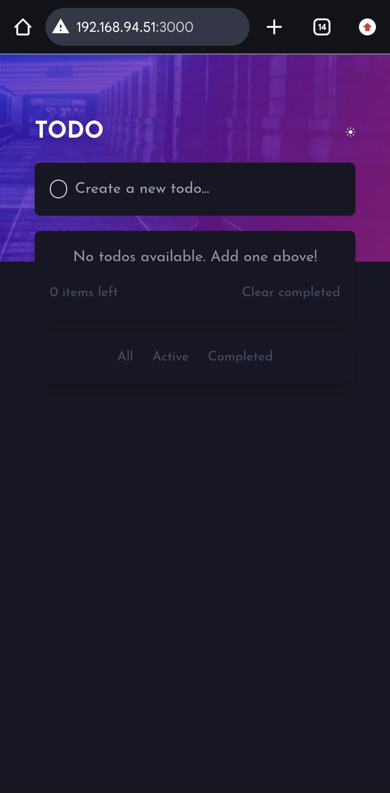
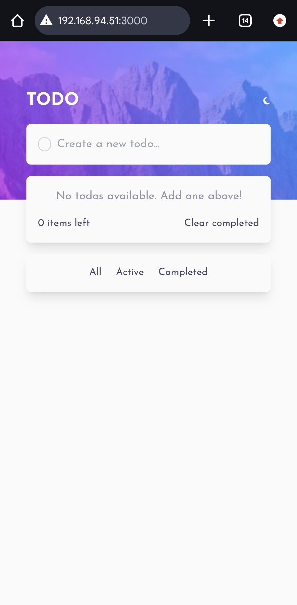

# Frontend Mentor - Todo app solution

This is a solution to the [Todo app challenge on Frontend Mentor](https://www.frontendmentor.io/challenges/todo-app-Su1_KokOW). Frontend Mentor challenges help you improve your coding skills by building realistic projects. 

## Table of contents

- [Overview](#overview)
  - [The challenge](#the-challenge)
  - [Screenshot](#screenshot)
  - [Links](#links)
- [My process](#my-process)
  - [Built with](#built-with)
  - [What I learned](#what-i-learned)
- [Author](#author)

## Overview

### The challenge

Users should be able to:

- View the optimal layout for the app depending on their device's screen size
- See hover states for all interactive elements on the page
- Add new todos to the list
- Mark todos as complete
- Delete todos from the list
- Filter by all/active/complete todos
- Clear all completed todos
- Toggle light and dark mode
- Drag and drop to reorder items on the list

### Screenshot

.png)
.png)

### Links

- Solution URL: [Solution](https://your-solution-url.com)
- Live Site URL: [To-do App](https://your-live-site-url.com)

## My process

### Built with

- [React](https://reactjs.org/) - JS library
- Tailwind
- Typescript
- Redux
- Flexbox

### What I learned

I have been stuck in tutorial hell on Redux, used this challenge to practice what I had learnt so far on redux and it was interesting while combining with React, Tailwindcss and typescript.

## Author

- Website - [dhanie_ellah](https://www.braidedaniella.netlify.app)
- Frontend Mentor - [@dhanie-ellah](https://www.frontendmentor.io/profile/dhanie-ellah)
- Github - [@dhanie-ellah](https://www.github.com/dhanie-ellah)

